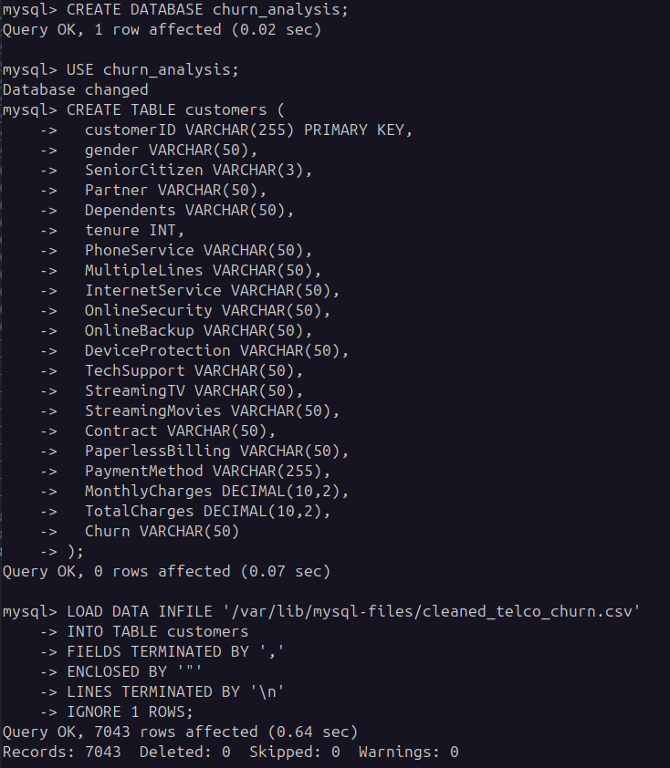
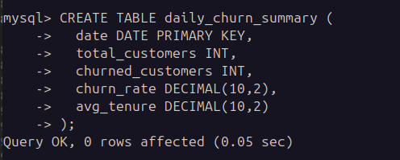
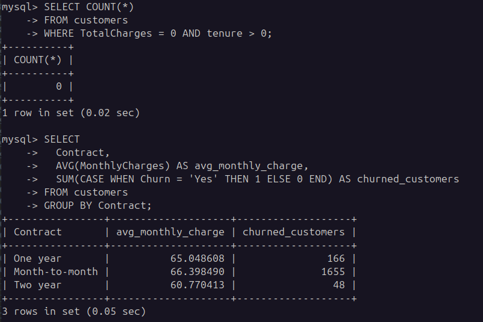
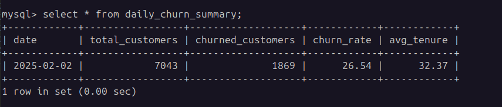

# MYSQL SETUP

We need a lightweight wetup to emulate a MySQL database. We will use Docker to create a MySQL container.

> Be sure to clean the data before making use of it.

## Step 1: Install Docker

You can download Docker Desktop from the following link: [https://www.docker.com/products/docker-desktop](https://www.docker.com/products/docker-desktop)
For Linux users, you can follow the instructions on this page: [https://docs.docker.com/engine/install/](https://docs.docker.com/engine/install/)

## Step 2: Create a MySQL Container

To create a MySQL container, run the following command in your terminal:

```bash
# start up the MySQL container
docker run --name mysql -e MYSQL_ROOT_PASSWORD=root -e MYSQL_DATABASE=mock_kaggle -p 3306:3306 -d mysql:latest

# see the running container
docker ps 
```


## Step 3: Connect to the MySQL Container

To connect to the MySQL container, run the following command in your terminal:

```bash
# copy the kaggle dataset to the container
docker cp ./data/cleaned_telco_churn.csv mysql:/var/lib/mysql-files/cleaned_telco_churn.csv

# connect to the MySQL container
docker exec -it mysql mysql -u root -p
```

## Step 4: Setup the MySQL Database

To setup the MySQL database, run the following command in your terminal:

```SQL
--- Create the DB
CREATE DATABASE churn_analysis;

--- Use the DB
USE churn_analysis;

--- Create a table
CREATE TABLE customers (
  customerID VARCHAR(255) PRIMARY KEY,
  gender VARCHAR(50),
  SeniorCitizen VARCHAR(3),
  Partner VARCHAR(50),
  Dependents VARCHAR(50),
  tenure INT,
  PhoneService VARCHAR(50),
  MultipleLines VARCHAR(50),
  InternetService VARCHAR(50),
  OnlineSecurity VARCHAR(50),
  OnlineBackup VARCHAR(50),
  DeviceProtection VARCHAR(50),
  TechSupport VARCHAR(50),
  StreamingTV VARCHAR(50),
  StreamingMovies VARCHAR(50),
  Contract VARCHAR(50),
  PaperlessBilling VARCHAR(50),
  PaymentMethod VARCHAR(255),
  MonthlyCharges DECIMAL(10,2),
  TotalCharges DECIMAL(10,2),
  Churn VARCHAR(50)
);

--- Load the CSV data into the table
LOAD DATA INFILE '/var/lib/mysql-files/cleaned_telco_churn.csv'
INTO TABLE customers
FIELDS TERMINATED BY ',' 
ENCLOSED BY '"'
LINES TERMINATED BY '\n'
IGNORE 1 ROWS;
```



```sql
--- Create the table for daily churn summary
CREATE TABLE daily_churn_summary (
  date DATE PRIMARY KEY,
  total_customers INT,
  churned_customers INT,
  churn_rate DECIMAL(10,2),
  avg_tenure DECIMAL(10,2)
);
```



```sql
--- Check the data for null or blanks that were in the previous one
SELECT COUNT(*) 
FROM customers 
WHERE TotalCharges = 0 AND tenure > 0;

--- 
SELECT 
  Contract, 
  AVG(MonthlyCharges) AS avg_monthly_charge,
  SUM(CASE WHEN Churn = 'Yes' THEN 1 ELSE 0 END) AS churned_customers
FROM customers
GROUP BY Contract;
```



## Step 5: Automate Data Updates

We will be using a cron job to automate the data updates. To do this, we will create a [Python script](./notebooks/daily_churn_update.py) that will update the data daily.

```bash
crontab -e

# Add to crontab
0 8 * * * /usr/bin/python3 /notebooks/daily_churn_update.py
```


