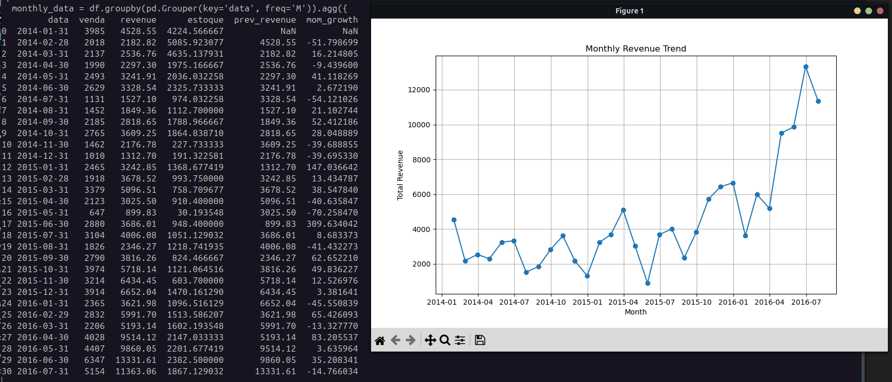

# MYSQL SETUP

We need a lightweight wetup to emulate a MySQL database. We will use Docker to create a MySQL container.

## Step 1: Install Docker

You can download Docker Desktop from the following link: [https://www.docker.com/products/docker-desktop](https://www.docker.com/products/docker-desktop)
For Linux users, you can follow the instructions on this page: [https://docs.docker.com/engine/install/](https://docs.docker.com/engine/install/)

## Step 2: Create a MySQL Container

To create a MySQL container, run the following command in your terminal:

```bash
# start up the MySQL container
docker run --name mysql -e MYSQL_ROOT_PASSWORD=root -e MYSQL_DATABASE=mock_kaggle -p 3306:3306 -d mysql:latest

# see the running container
docker ps 
```


## Step 3: Connect to the MySQL Container

To connect to the MySQL container, run the following command in your terminal:

```bash
# copy the kaggle dataset to the container
docker cp ./mock_kaggle.csv mysql:/var/lib/mysql-files/mock_kaggle.csv

# connect to the MySQL container
docker exec -it mysql mysql -u root -p
```

## Step 4: Setup the MySQL Database

To setup the MySQL database, run the following command in your terminal:

```SQL
--- Create the DB
CREATE DATABASE mock_kaggle;

--- Use the DB
USE mock_kaggle;

--- Create a table
CREATE TABLE retail_sales ( data DATE, venda INT, estoque INT, preco DECIMAL(10,2) );

--- Load the CSV data into the table
LOAD DATA INFILE '/var/lib/mysql-files/mock_kaggle.csv' INTO TABLE retail_sales FIELDS TERMINATED BY ',' LINES TERMINATED BY '\n' IGNORE 1 ROWS;
```


## Step 5: Query the MySQL Database

```SQL
--- Aggregate Sales by Date and Revenue:
SELECT DATE_FORMAT(data, '%Y-%m') AS sale_month, SUM(venda * preco) AS total_revenue, SUM(venda) AS total_units_sold FROM retail_sales GROUP BY sale_month ORDER BY sale_month;
```


```SQL
--- Month over Month revenue growth:
SELECT sale_month, total_revenue, LAG(total_revenue) OVER (ORDER BY sale_month) AS prev_month_revenue, ROUND( ((total_revenue - LAG(total_revenue) OVER (ORDER BY sale_month)) / LAG(total_revenue) OVER (ORDER BY sale_month)) * 100, 2 ) AS mom_growth FROM ( SELECT DATE_FORMAT(data, '%Y-%m') AS sale_month, SUM(venda * preco) AS total_revenue FROM retail_sales GROUP BY sale_month ) AS monthly;
```


### Output from Python




